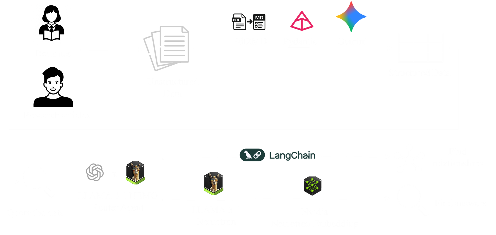
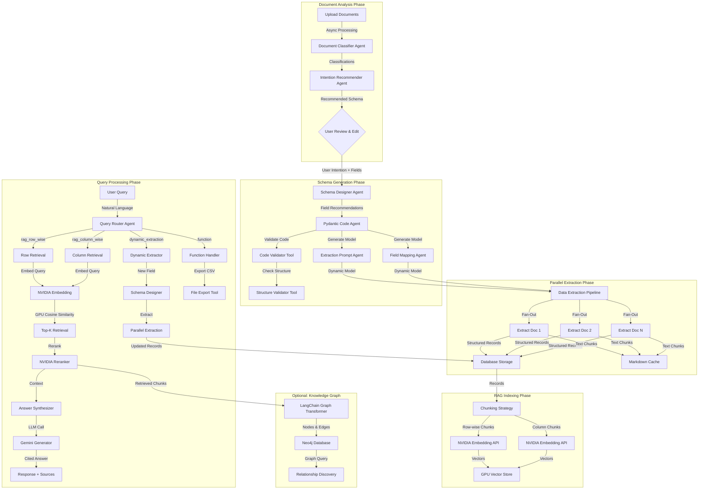

# 🌟⚡ **Lumina**

<p align="center">
  
</p>

### **From Unstructured Chaos to Structured Insight | Multi-Agent Document Intelligence**

[]()
[]()
[]()
[]()
[]()
[]()
[]()
[]()
[]()


---

## ⚡ Quick Start

Get Lumina running in 5 minutes:

```bash
# 1. Clone the repository
git clone https://github.com/Bourn23/doc2table.git
cd doc2table

# 2. Setup environment and credentials (one-time setup)
chmod +x setup-environment.sh
./setup-environment.sh interactive

# 3. Run the deployment script
chmod +x manage-lumina.sh
./manage-lumina.sh

# 4. Select Option 2: Deploy Backend
# 5. Select Option 3: Deploy Frontend
```

**That's it!** Your Lumina instance will be live at the S3 URL shown by the script.

📖 **New to Lumina?** Check out the [Deployment Guide](DETAILED_DEPLOYMENT_GUIDE.md) for detailed instructions.

---

## 📚 Table of Contents

- [Overview](#-overview)
- [The Problem](#the-problem-with-manual-data-extraction)
- [Our Solution](#our-solution-agentic-document-intelligence)
- [Key Differentiators](#-key-differentiators)
- [Core Stack](#-core-stack)
- [Features](#-features)
- [**🚀 Deployment Guide**](DETAILED_DEPLOYMENT_GUIDE.md) ← **Start Here**
- [Technology Stack Details](#-technology-stack-details)
- [Project Structure](#️-project-structure)
- [Roadmap](#️-roadmap)
- [Contributing](#-contributing)

---

## 📖 Additional Documentation

- **[Technical Deep Dive](TECHNICAL_DEEP_DIVE.md)** - Comprehensive guide to architecture, AI integration, and implementation details
- **[Hackathon Evaluation](kiro-documentation/hackathon-evaluation/)** - Detailed technical analysis and competitive positioning

---

## 🎯 Overview

**Lumina** is a **production-ready document intelligence system** that transforms unstructured documents into queryable, structured knowledge. Built on a **multi-agent AI architecture**, it automatically analyzes your documents, designs optimal extraction schemas, extracts data with precision, and enables natural language querying through advanced RAG (Retrieval-Augmented Generation).

> 🔮 *Lumina makes document intelligence automated, precise, and conversational. And above all, open-sourced.*

### **What Makes Lumina Different**

Unlike single-model AI tools that hallucinate or hit file limits, Lumina uses **seven specialized agents** working together in a deterministic pipeline:

- 🤖 **Multi-Agent Architecture** - Each agent has one focused task
- ✅ **Structured Validation** - Pydantic models ensure data quality
- 📊 **Unlimited Scale** - Process 100+ documents vs 10-20 file limits
- 💰 **Cost-Effective** - ~$32/month vs $10,000+/year enterprise tools
- 🔓 **Open Source** - Self-hosted, transparent, customizable
- 🎯 **Citation-Backed** - Every fact traced to source document

---

## The Problem: Document Analysis Doesn't Scale

**Have you ever needed to analyze dozens of contracts, research papers, or financial reports—only to hit the '10 file upload limit' on every AI tool?**

### The Hidden Cost of Manual Extraction

- **$28,500 per employee annually** - Cost of manual data extraction in U.S. companies
- **28% of work time** - Researchers spend over a quarter of their time on manual extraction
- **10-20 file maximum** - Existing AI tools (ChatGPT, Claude) severely limit document uploads
- **Research-only tools** - Academic tools (SciSpace, Elicit) don't work for business documents
- **$10,000+ per seat** - Enterprise solutions (Hebbia, Palantir) are prohibitively expensive
- **No open-source alternatives** - Until now, no scalable open-source solution existed

### The Traditional Workflow (Broken)

1. **Manually design** schemas for each document type
2. **Labor-intensive** reading of all documents
3. **Manually extract** data from PDFs into spreadsheets
4. **Re-read** documents multiple times to answer new questions
5. **Lose context** when documents don't fit your predefined structure

**This is slow, error-prone, and doesn't scale** when you have 20+ documents to analyze.

---

## Our Solution: Agentic AI for Document Intelligence

Lumina fixes this with **specialized AI agents** that collaborate with you to understand documents, design extraction schemas, extract structured data, and answer questions—all with validation at every step.

### What is Agentic Extraction?

Instead of one large AI model trying to do everything (and hallucinating), Lumina uses **seven specialized agents** working together in a deterministic pipeline:

- **Document Classifier**: Analyzes document types, domains, and content structure
- **Intention Recommender**: Suggests what data you should extract based on document analysis
- **Schema Designer**: Creates optimized Pydantic models for your extraction task
- **Pydantic Code Generator**: Writes production-ready validation code
- **Extraction Agent**: Extracts structured data from each document in parallel
- **Query Router**: Classifies user questions and routes to the right processing pipeline
- **Answer Synthesizer**: Generates cited answers from retrieved evidence

**Key Innovation**: Each agent has **one focused task** and does it well. This deterministic pipeline dramatically reduces hallucination compared to single-model systems.



### User-in-the-Loop Validation

Unlike fully automated systems, Lumina gives you control:

```
1. AI analyzes documents → Recommends extraction schema
2. YOU review and customize → Add/remove/edit fields
3. AI extracts with YOUR schema → Validated, structured data
4. Query naturally → Get cited, accurate answers
```

This prevents wasted extraction and ensures the output matches your needs.

---

## 📊 Key Differentiators

### Lumina vs. Competitors

| Feature | Lumina | ChatGPT/Claude | SciSpace/Elicit | Hebbia/Palantir |
|---------|--------|----------------|-----------------|-----------------|
| **File Limit** | ✅ Unlimited | ❌ 10-20 | ⚠️ Research only | ✅ Unlimited |
| **Validation** | ✅ Pydantic | ❌ None | ❌ None | ✅ Custom |
| **Open Source** | ✅ Yes | ❌ No | ❌ No | ❌ No |
| **Cost/Month** | 💰 ~$32 | 💰 $20 | 💰 $20 | 💰💰💰 $10K+/year |
| **Custom Schema** | ✅ Yes | ❌ No | ❌ No | ✅ Yes |
| **Citation** | ✅ Yes | ⚠️ Limited | ✅ Yes | ✅ Yes |
| **Deployment** | ✅ Self-hosted | ❌ Cloud only | ❌ Cloud only | ❌ Enterprise only |

## 🧩 Core Stack

| Layer | Technology | Purpose |
|-------|-------------|---------|
| **Orchestration** | `OpenAI Agents SDK` | Multi-agent coordination and tool calling |
| **Generation** | `NVIDIA llama-3.1-nemotron-8b` | High-quality text generation for queries |
| **Extraction** | `Google Gemini 2.5 Flash` | Fast, accurate structured extraction |
| **Embedding** | `NVIDIA llama-3.2-nv-retriever-300m` | Vector embeddings for semantic search |
| **Reranking** | `NVIDIA llama-3.2-nemoretriever-500m` | Precision reranking of search results |
| **Vector Compute** | `FAISS (GPU-accelerated)` | Fast similarity search with GPU support |
| **API Framework** | `FastAPI (Async)` | High-performance async REST API |
| **Database** | `PostgreSQL (Async)` | Persistent session and record storage |
| **Job Queue** | `Redis` | Job tracking and pub/sub messaging |
| **Document Processing** | `PyMuPDF + pandas` | PDF, CSV, text file parsing |
| **Schema Validation** | `Pydantic V2` | Dynamic model generation with validators |
| **Frontend** | `React + TypeScript` | Interactive document upload and query interface |

---

## 🚀 Features

### Core Capabilities
- 🤖 **7 Specialized Agents** – Each with a focused task in the extraction pipeline
- 📄 **Multi-Format Processing** – Handles various types of documents including PDFs, CSVs, text files, markdown
- 🧠 **Intelligent Schema Generation** – AI recommends optimal extraction fields
- ⚡ **Parallel Extraction** – Concurrent processing of multiple documents
- 🔍 **Advanced RAG Pipeline** – Embedding → Retrieval → Reranking → Generation
- 🎯 **Dynamic Field Extraction** – Add new fields without reprocessing documents
- 🗺️ **Knowledge Graph Construction** – Automatic relationship discovery
- 💾 **Production-Ready** – Async database, retry logic, comprehensive error handling
- 🔗 **Knowledge Graph** - Automatic relationship discovery (optional)

### What Makes Lumina Unique

- ✅ **User-in-the-Loop Schema Design** – Review, customize, and edit before extraction
- ✅ **Dynamic Field Extraction** – Add new fields without reprocessing all documents
- ✅ **Validation at Every Step** – Code validation before execution, structure checks for Pydantic models, Retry logic with exponential backoff, Error handling with actionable messages
- ✅ **Structured Evidence for RAG** – Every fact traced to source document because Lumina only uses **pre-extracted structured field** reducing hallucination risk.
- ✅ **Markdown Caching** – Converted documents cached for re-use
- ✅ **Export to CSV** – Download structured data with timestamps

---

### Lumina's Approach:

Traditional RAG systems have the LLM re-interpret text chunks (hallucination risk). Lumina uses **pre-extracted structured fields**:

```
Query: "What temperature was used for TiO2 synthesis?"

Traditional RAG:
1. Retrieve text: "...the synthesis was performed at 350 degrees..."
2. LLM interprets → Risk of misreading units, hallucination

Lumina's Approach:
1. Router detects 'temperature' field exists
2. GPU search retrieves records mentioning TiO2
3. Reranker sorts by relevance
4. Returns structured field:
   {
     "material_name": "TiO2 nanoparticles",
     "synthesis.temperature": 350.0,  # ← Validated number
     "_source_document": "paper_1.pdf"
   }
5. Answer: "TiO2 was synthesized at 350.0°C (paper_1.pdf:record_0)" ✅
```

**Benefits:**
- ✅ Type validation (number vs string)
- ✅ Source tracking (document + record ID)
- ✅ No re-interpretation (uses pre-extracted data)
- ✅ Quality control (Pydantic ensures data validity)

---

## 📊 Technology Stack Details

### Multi-Agent Orchestration
- **OpenAI Agents SDK**: Tool calling, structured outputs, agent coordination
- **Retry Logic**: Exponential backoff with timeout for LLM calls

### Embedding & Retrieval
- **NVIDIA NIM Embedder**: `llama-3.2-nemoretriever-300m-embed-v1`
  - 1024-dimensional embeddings
  - Separate encoding for queries vs passages
  - OpenAI-compatible API


### Reranking
- **NVIDIA NIM Reranker**: `llama-3.2-nemoretriever-500m-rerank-v2`
  - Improves precision of top-k results
  - Logit scores for relevance ranking
  - REST API with requests Session

### Generation
- **Gemini 2.5 Flash**: Primary LLM for extraction
   - PyDantic schema generation, extraction
- **NVIDIA llama 3.1 Nemotron 8B**: Primary LLM for query
  - Query router agent
  - Answer synthesis and Knowledge graph generation
  - Structured output with Pydantic models
  - Context window: 1M tokens
- **Ollama (Optional)**: Local model support (coming soon)
  - Qwen 3 0.6B for lightweight extraction
  - Self-hosted alternative to cloud APIs

### Data Storage
- **SQLAlchemy (Async)**:
  - PostgreSQL for production
  - SQLite for development
  - Async sessions with connection pooling
- **Tables**:
  - `sessions`: Extraction jobs with schemas
  - `uploaded_files`: Document metadata
  - `extracted_records`: Structured data (JSONB column)

### Document Processing
- **PyMuPDF (fitz)**: PDF text extraction
  - Page-by-page parsing
  - Handles multi-column layouts
- **pandas**: CSV/Excel processing
- **Markdown Caching**: Converted docs saved to `converted_markdown/`

### Knowledge Graph (Optional)

- **LangChain**: Document → Graph transformation
  - Entity extraction from text
  - Relationship inference

---

## 🏗️ Project Structure

### Microservices Architecture

```
┌─────────────────────────────────────────────────────┐
│                  Docker Compose                     │
│                                                     │
│  ┌──────────────┐  ┌──────────────┐  ┌───────────┐  │
│  │ API Gateway  │  │ Extraction   │  │   Query   │  │
│  │ (Port 8000)  │◄─┤   Service    │◄─┤  Service  │  │
│  │              │  │ (Port 8001)  │  │(Port 8002)│  │
│  │ Orchestrates │  │ Schema Gen   │  │ RAG +     │  │
│  │ all services │  │ + Extraction │  │ Indexing  │  │
│  └──────┬───────┘  └──────┬───────┘  └─────┬─────┘  │
│         │                 │                │        │
│  ┌──────▼─────────────────▼────────────────▼────┐   │
│  │          Shared Volumes (Data Persistence)   │   │
│  │  • uploaded_files/   • indexes/              │   │
│  │  • converted_markdown/  • exports/           │   │
│  └──────────────────────────────────────────────┘   │
│                                                     │
│  ┌──────────────┐              ┌────────────────┐   │
│  │  PostgreSQL  │              │     Redis      │   │
│  │  (Database)  │              │  (Job Queue)   │   │
│  └──────────────┘              └────────────────┘   │
└─────────────────────────────────────────────────────┘
                    │                    │
                    ▼                    ▼
          ┌─────────────────┐  ┌─────────────────┐
          │   NVIDIA NIM    │  │  Google Gemini  │
          │   (Embedding,   │  │  (Extraction)   │
          │    Reranking,   │  │                 │
          │    Generation)  │  │                 │
          └─────────────────┘  └─────────────────┘
```

### Key Architecture Features

- ✅ **Async operations** - FastAPI + SQLAlchemy async throughout
- ✅ **Horizontal scaling** - Microservices can scale independently
- ✅ **GPU acceleration** - FAISS for fast vector search
- ✅ **Shared volumes** - Data persistence across services
- ✅ **Health checks** - Docker monitors service health
- ✅ **Connection pooling** - Efficient database connections
- ✅ **Job tracking** - Redis pub/sub for real-time updates

---

## 💼 Use Cases

### Target Audiences

#### 1. **Academic Researchers**
- Literature reviews across 10+ papers
- Extracting experimental parameters (temperature, materials, results)
- Comparing methodologies across studies
- Building structured datasets from publications

**Example**: "Extract synthesis temperature, material composition, and particle size from 100 nanotechnology papers"

#### 2. **Legal Professionals**
- Contract analysis and due diligence
- Extracting key terms, dates, obligations
- Comparing clauses across agreements
- Risk assessment from legal documents

**Example**: "Extract payment terms, termination clauses, and liability limits from 50 vendor contracts"

#### 3. **Financial Analysts**
- Processing earnings reports and 10-Ks
- Extracting financial metrics across companies
- Comparing performance indicators
- Building industry comparison tables

**Example**: "Extract revenue, EBITDA, and guidance from Q3 earnings calls for all tech companies"

#### 4. **Healthcare Researchers**
- Clinical trial data extraction
- Patient outcome analysis
- Treatment protocol comparison
- Medical literature synthesis

**Example**: "Extract patient demographics, treatment protocols, and outcomes from 200 clinical trial reports"

#### 5. **Business Analysts**
- Market research report analysis
- Competitive intelligence gathering
- Customer feedback synthesis
- Industry trend analysis

**Example**: "Extract market size, growth rate, and key players from 30 industry research reports"

---

## 🗺️ Roadmap

### Phase 1: Core Intelligence (Current)
- ✅ Multi-agent extraction pipeline
- ✅ GPU-accelerated RAG
- ✅ Dynamic field extraction
- ✅ Knowledge graph construction

### Phase 2: Enhanced Capabilities 
- [ ] **Table Extraction**: Dedicated agent for query generation and extracting data from complex tables
- [ ] **Image Analysis**: Extract data from charts/figures (OCR + VLM)
- [ ] **Custom Validators**: User-defined validation logic


---

## 🤝 Contributing

We welcome contributions! Here's how:


## 🌟 Recognition

Built by researchers, for researchers who are tired of manual data extraction.

**Core Innovation:**
- Multi-agent architecture where each agent has a single, focused task
- Dynamic schema generation and on-demand field extraction
- GPU-accelerated retrieval with structured evidence for hallucination reduction
- Markdown caching for fast re-extraction without re-upload

**Key Technologies:**
- OpenAI Agents SDK for agentic coordination
- NVIDIA NIM for embedding and reranking and high-quality generation

---

### Architecture Overview



---

## 📄 License

This project is licensed under the MIT License - see the [LICENSE](LICENSE) file for details.

---

## 📧 Contact

- **GitHub Issues** - For bug reports and feature requests
- **Email** - [bourn23@gmail.com]

---

## 📖 Learn More

### For Users
- **[Quick Start Guide](#-quick-start)** - Get running in 5 minutes
- **[Deployment Guide](#-deployment-guide)** - Detailed deployment instructions
- **[Troubleshooting](#troubleshooting)** - Common issues and solutions

### For Developers
- **[Technical Deep Dive](TECHNICAL_DEEP_DIVE.md)** - Architecture, AI integration, and implementation
- **[Troubleshooting](TROUBLESHOOT.md)** - Different Troubleshooting information
- **[Project Structure](#️-project-structure)** - Codebase organization
- **[Contributing](#-contributing)** - How to contribute


[⬆ back to top](#-lumina)

</div>
