# 🌟⚡ **Lumina**

<p align="center">
  
</p>

### **From Unstructured Chaos to Structured Insight | Multi-Agent Document Intelligence**

[]()
[]()
[]()
[]()
[]()

---

## 🎯 Overview

**Lumina** is an **intelligent document processing system** that transforms unstructured documents into queryable, structured knowledge. Built on a **multi-agent AI architecture**, it automatically analyzes your documents, designs optimal extraction schemas, extracts data with precision, and enables natural language querying through advanced RAG (Retrieval-Augmented Generation).

> 🔮 *Lumina combines agent-driven extraction with GPU-accelerated retrieval — making document intelligence automated, precise, and conversational.*

---

## The Problem with Manual Data Extraction

Today's researchers spend **28% of their time** extracting data from papers. We make it **automatic**.

Traditional data extraction requires you to:
1. **Manually design** schemas for each document type
2. **Labor intensive** job reading all the documents
3. **manually extract** data from PDFs into spreadsheets
3. **Re-read** documents multiple times to answer new questions
4. **Lose context** when documents don't fit your predefined structure

This is **slow, error-prone, and doesn't scale** when you have hundreds of papers to analyze.

## Our Solution: Agentic Document Intelligence

We fix this by using **specialized AI agents** that collaborates with the user, understand your documents, design extraction schemas, extract structured data, and answer questions.

### What is Agentic Extraction?

Instead of one large AI model trying to do everything, Lumina uses **seven specialized agents** working together:

- **Document Classifier**: Analyzes document types, domains, and content structure
- **Intention Recommender**: Suggests what data you should extract based on document analysis
- **Schema Designer**: Creates optimized Pydantic models for your extraction task
- **Pydantic Code Generator**: Writes production-ready validation code
- **Extraction Agent**: Extracts structured data from each document in parallel
- **Query Router**: Classifies user questions and routes to the right processing pipeline
- **Answer Synthesizer**: Generates cited answers from retrieved evidence

Unlike single-model systems (which hallucinate), our **agent pipeline is deterministic** — each agent has one job and does it well.


---

## 🧩 Core Stack

| Layer | Technology | Purpose |
|-------|-------------|---------|
| **Orchestration** | `OpenAI Agents SDK` | Multi-agent coordination and tool calling |
| **Generation** | `NVIDIA llama-3.1-nemotron-8b` | High-quality text generation for extraction |
| **Embedding** | `NVIDIA llama-3.2-nv-retriever-300m` | Vector embeddings for semantic search |
| **Reranking** | `NVIDIA llama-3.2-nemoretriever-reranker-500m` | Precision reranking of search results |
| **Vector Compute** | `FAISS` | GPU-accelerated similarity search |
| **API Framework** | `FastAPI (Async)` | High-performance async REST API |
| **Database** | `SQLAlchemy (Async) + PostgreSQL/SQLite` | Persistent session and record storage |
| **Knowledge Graph** | `LangChain` | Relationship extraction |
| **Document Processing** | `PyMuPDF (fitz) + pandas` | PDF, CSV, text file parsing |
| **Schema Validation** | `Pydantic V2` | Dynamic model generation with validators |
| **Frontend (UI)** | `React` | Interactive document upload and query interface |

---

## 🚀 Features

### Core Capabilities
- 🤖 **7 Specialized Agents** – Each with a focused task in the extraction pipeline
- 📄 **Multi-Format Processing** – Handles various types of documents including PDFs, CSVs, text files, markdown
- 🧠 **Intelligent Schema Generation** – AI recommends optimal extraction fields
- ⚡ **Parallel Extraction** – Concurrent processing of multiple documents
- 🔍 **Advanced RAG Pipeline** – Embedding → Retrieval → Reranking → Generation
- 🎯 **Dynamic Field Extraction** – Add new fields without reprocessing documents
- 🗺️ **Knowledge Graph Construction** – Automatic relationship discovery
- 💾 **Production-Ready** – Async database, retry logic, error handling

### What Makes Lumina Different
- ✅ **User-in-the-Loop Schema Design** – Review, customize, and edit before extraction
- ✅ **Validation at Every Step** – Code validation, structure checks, retry logic
- ✅ **Citation-Backed Answers** – Every fact traced to source document
- ✅ **Markdown Caching** – Converted documents cached for re-use
- ✅ **Export to CSV/JSON** – Download structured data with timestamps

---

### Lumina's Approach:
```
Query: "What temperature was used for TiO2 synthesis?"

1. Router Agent → Detects 'temperature' field exists → rag_row_wise
2. GPU Search → Retrieves records mentioning TiO2
3. Reranker → Re-sorts by relevance
4. Structured Evidence:
   {
     "material_name": "TiO2 nanoparticles",
     "synthesis.temperature": 350.0,
     "_source_document": "paper_1.pdf"
   }
5. Answer Synthesizer → Uses structured field directly
Answer: "TiO2 was synthesized at 350.0°C (paper_1.pdf:record_0)" ✅
```

**Key Differences:**
- ✅ **Structured Fields**: Extraction validates types (number vs string)
- ✅ **Source Tracking**: Every value traced to document + record ID
- ✅ **No Re-Parsing**: LLM doesn't re-interpret text (uses pre-extracted data)
- ✅ **Validation**: Pydantic ensures data quality (ranges, patterns)

---


---

## 📊 Technology Stack Details

### Multi-Agent Orchestration
- **OpenAI Agents SDK**: Tool calling, structured outputs, agent coordination
- **Retry Logic**: Exponential backoff with timeout for LLM calls

### Embedding & Retrieval
- **NVIDIA NIM Embedder**: `llama-3.2-nemoretriever-300m-embed-v1`
  - 1024-dimensional embeddings
  - Separate encoding for queries vs passages
  - OpenAI-compatible API


### Reranking
- **NVIDIA NIM Reranker**: `llama-3.2-nemoretriever-500m-rerank-v2`
  - Improves precision of top-k results
  - Logit scores for relevance ranking
  - REST API with requests Session

### Generation
- **NVIDIA llama 3.1 Nemotron 8B**: Primary LLM
  - Schema generation, extraction, answer synthesis
  - Structured output with Pydantic models
  - Context window: 1M tokens
- **Ollama (Optional)**: Local model support
  - Qwen 3 0.6B for lightweight extraction
  - Self-hosted alternative to cloud APIs

### Data Storage
- **SQLAlchemy (Async)**:
  - PostgreSQL for production
  - SQLite for development
  - Async sessions with connection pooling
- **Tables**:
  - `sessions`: Extraction jobs with schemas
  - `uploaded_files`: Document metadata
  - `extracted_records`: Structured data (JSONB column)

### Document Processing
- **PyMuPDF (fitz)**: PDF text extraction
  - Page-by-page parsing
  - Handles multi-column layouts
- **pandas**: CSV/Excel processing
- **Markdown Caching**: Converted docs saved to `converted_markdown/`

### Knowledge Graph (Optional)

- **LangChain**: Document → Graph transformation
  - Entity extraction from text
  - Relationship inference
  - Temporal metadata tracking

---

## 🏗️ Project Structure

```
lumina/
├── api.py                          # FastAPI application
├── database.py                     # SQLAlchemy async setup
├── models.py                       # Database models
│
├── data_agents/
│   ├── agents_collection.py        # All 7 agents + orchestration
│   ├── rag_agent.py               # RAG pipeline class
│   └── tools.py                   # Pydantic schemas for agents
│
├── prompts/                        # Agent system prompts
│   ├── schema_agent.txt
│   ├── pydantic_code_agent.txt
│   ├── extraction_prompt_agent.txt
│   └── answer_synthesizer.txt
│
├── converted_markdown/             # Cached converted documents
│   ├── paper1.md
│   └── data.md
│
├── exports/                        # CSV/JSON exports
│   └── lumina_export_20250104.csv
│
├── tests/
│   ├── test_api.py
│   ├── test_agents.py
│   └── fixtures/
│
├── requirements.txt
├── .env                           # API keys (not committed)
├── README.md
└── DEPLOYMENT-GUIDE.md
```

---


---

## 🗺️ Roadmap

### Phase 1: Core Intelligence (Current)
- ✅ Multi-agent extraction pipeline
- ✅ GPU-accelerated RAG
- ✅ Dynamic field extraction
- ✅ Knowledge graph construction

### Phase 2: Enhanced Capabilities 
- [ ] **Table Extraction**: Dedicated agent for query generation and extracting data from complex tables
- [ ] **Image Analysis**: Extract data from charts/figures (OCR + VLM)
- [ ] **Custom Validators**: User-defined validation logic


---

## 🤝 Contributing

We welcome contributions! Here's how:


## 🌟 Recognition

Built by researchers, for researchers who are tired of manual data extraction.

**Core Innovation:**
- Multi-agent architecture where each agent has a single, focused task
- Dynamic schema generation and on-demand field extraction
- GPU-accelerated retrieval with structured evidence for hallucination reduction
- Markdown caching for fast re-extraction without re-upload

**Key Technologies:**
- OpenAI Agents SDK for agentic coordination
- NVIDIA NIM for embedding and reranking and high-quality generation

---

### Architecture Overview

```mermaid
graph TB
    subgraph "Document Analysis Phase"
        A[Upload Documents] -->|Async Processing| B[Document Classifier Agent]
        B -->|Classifications| C[Intention Recommender Agent]
        C -->|Recommended Schema| D{User Review & Edit}
    end
    
    subgraph "Schema Generation Phase"
        D -->|User Intention + Fields| E[Schema Designer Agent]
        E -->|Field Recommendations| F[Pydantic Code Agent]
        F -->|Validate Code| G[Code Validator Tool]
        G -->|Check Structure| H[Structure Validator Tool]
        F -->|Generate Model| I[Extraction Prompt Agent]
        F -->|Generate Model| J[Field Mapping Agent]
    end
    
    subgraph "Parallel Extraction Phase"
        I & J -->|Dynamic Model| K[Data Extraction Pipeline]
        K -->|Fan-Out| L1[Extract Doc 1]
        K -->|Fan-Out| L2[Extract Doc 2]
        K -->|Fan-Out| L3[Extract Doc N]
        
        L1 & L2 & L3 -->|Structured Records| M[Database Storage]
        L1 & L2 & L3 -->|Text Chunks| N[Markdown Cache]
    end
    
    subgraph "RAG Indexing Phase"
        M -->|Records| O[Chunking Strategy]
        O -->|Row-wise Chunks| P[NVIDIA Embedding API]
        O -->|Column Chunks| Q[NVIDIA Embedding API]
        P & Q -->|Vectors| R[GPU Vector Store]
    end
    
    subgraph "Query Processing Phase"
        S[User Query] -->|Natural Language| T[Query Router Agent]
        
        T -->|rag_row_wise| U1[Row Retrieval]
        T -->|rag_column_wise| U2[Column Retrieval]
        T -->|dynamic_extraction| U3[Dynamic Extractor]
        T -->|function| U4[Function Handler]
        
        U1 & U2 -->|Embed Query| V[NVIDIA Embedding]
        V -->|GPU Cosine Similarity| W[Top-K Retrieval]
        W -->|Rerank| X[NVIDIA Reranker]
        X -->|Context| Y[Answer Synthesizer]
        
        U3 -->|New Field| Z1[Schema Designer]
        Z1 -->|Extract| Z2[Parallel Extraction]
        Z2 -->|Updated Records| M
        
        U4 -->|Export CSV| AA[File Export Tool]
        
        Y -->|LLM Call| AB[Gemini Generator]
        AB -->|Cited Answer| AC[Response + Sources]
    end
    
    subgraph "Optional: Knowledge Graph"
        X -->|Retrieved Chunks| KG1[LangChain Graph Transformer]
        KG1 -->|Nodes & Edges| KG2[Neo4j Database]
        KG2 -->|Graph Query| KG3[Relationship Discovery]
    end
```



<div align="center">

**From Chaos to Clarity**: Where multi-agent AI meets document intelligence to extract the knowledge hidden in your papers.

[⬆ back to top](#-lumina)

</div>
